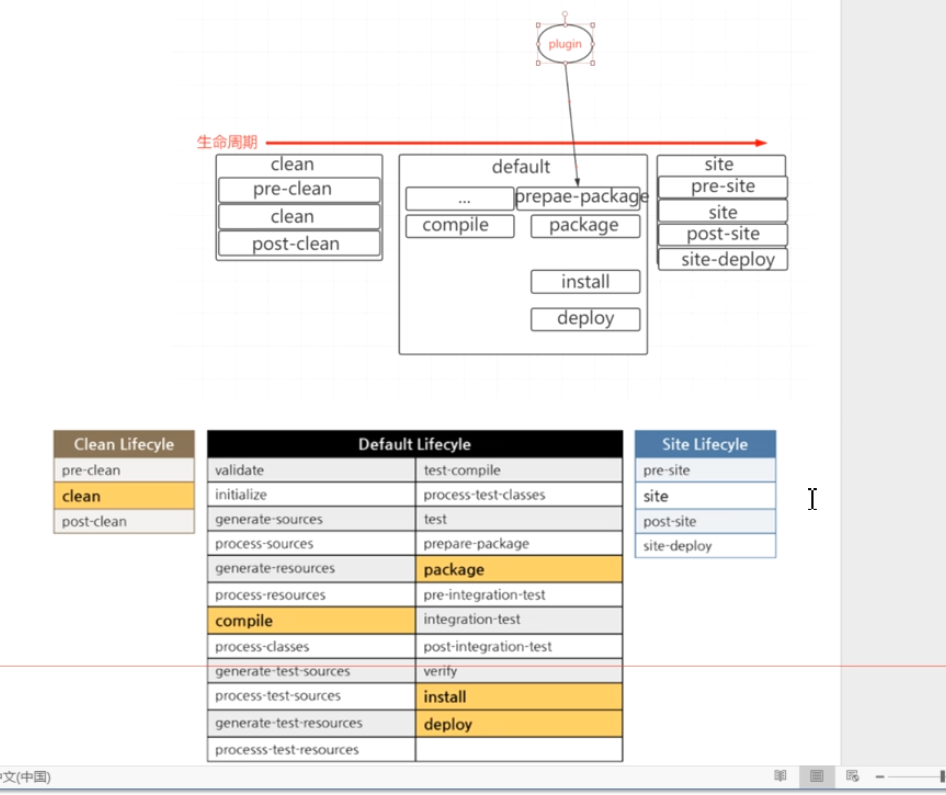
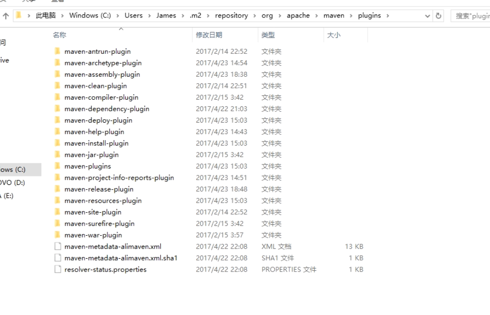
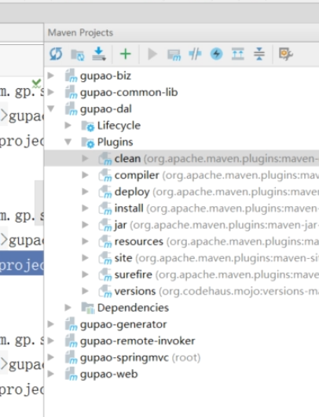
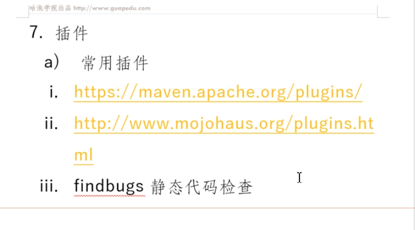

工厂专题之MAVEN

# 是什么

优势：

约定优于配置

简单

测试支持

构建简单

CI

插件丰富

# 安装使用

安装，配置

文件目录: 

boot

超级pom文件位于：lib/maven-model-builder-3.8.3 jar包下

配置文件优先级：从高往下 优先级降低

* ~/m2/setting.xml  用户目录下
* conf/setting.xml  全局配置文件，安装包下

标准的配置文件一般位于jar下，安装包默认提供。

创建maven项目的默认文件结构由脚手架决定

setting.xml配置文件内容：

pluginGroup : 插件  

servers:

mirrors

profile 切换环境

pom.xml结构

scope

依赖传递

依赖仲裁

最短路径

加载先后

exclusions

生命周期： 只有三块

每个生命周期都是按照顺序来执行的

 clean: 

 default

site 

每个生命周期都有不同的phase 阶段

认识maven结构

setting pom 元素解读

坐标 依赖

 生命周期  插件

inherit module

自定义plugin

repository

testing

convention over configuration 

版本管理

profile

自定义脚手架

版本管理：

使用别人的jar包别人更新后自己需要做的处理：两者都可以

1、repository删除后重新下载

2、mvn clean packuge -U 强制拉取一次

主版本号.次版本号.增量版本号.-<里程碑版本>

常用命令

插件地址：

默认插件

build顺序

插件：

常用插件

versions 统一升级版本

