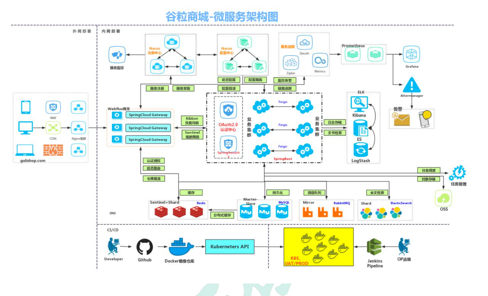
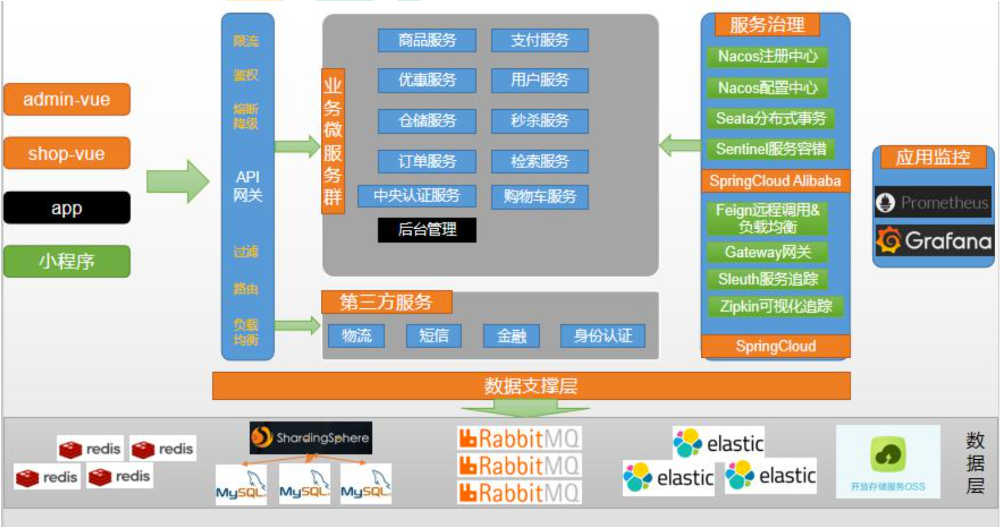

# 1项目背景

## 1.1电商模式

市面上有 5 种常见的电商模式 B2B、B2C、C2B、C2C、O2O;
 **1**、**B2B** 模式
 B2B (Business to Business)， 是指商家与商家建立的商业关系。 如:阿里巴巴

**2**、**B2C** 模式
 B2C (Business to Consumer)， 就是我们经常看到的供应商直接把商品卖给用户，即“商对客” 模式，也就是通常说的商业零售，直接面向消费者销售产品和服务。如:苏宁易购、京东、 天猫、小米商城

**3**、**C2B** 模式
 C2B (Customer to Business)，即消费者对企业。先有消费者需求产生而后有企业生产，即先 有消费者提出需求，后有生产企业按需求组织生产

**4**、**C2C** 模式
 C2C (Customer to Consumer) ，客户之间自己把东西放上网去卖，如:淘宝，闲鱼

**5**、**O2O** 模式
 O2O 即 Online To Offline，也即将线下商务的机会与互联网结合在了一起，让互联网成为线 下交易的前台。线上快速支付，线下优质服务。如:饿了么，美团，淘票票，京东到家
 **谷粒商城是一个 B2C 模式的电商平台，销售自营商品给客户。**

## 1.2项目架构图



## 1.3微服务划分图



## 1.4项目特色

* 前后分离开发，并开发基于vue的后台管理系统

* SpringCloud全新的解决方案

* 应用监控、限流、网关、熔断降级等分布式方案 全方位涉及  透彻讲解分布式事务、分布式锁等分布式系统的难点

* 分析高并发场景的编码方式，线程池，异步编排等使用

* 压力测试与性能优化

* 各种集群技术的区别以及使用

* CI/CD使用

# 2分布式基础概念

## 2.1微服务

微服务架构风格，就像是把一个单独的应用程序开发为一套小服务，每个小服务运行在自 己的进程中，并使用轻量级机制通信，通常是 HTTP API。这些服务围绕业务能力来构建， 并通过完全自动化部署机制来独立部署。这些服务使用不同的编程语言书写，以及不同数据 存储技术，并保持最低限度的集中式管理。

 简而言之:拒绝大型单体应用，基于业务边界进行服务微化拆分，各个服务独立部署运行。

## 2.2集群

## 2.3分布式

## 2.4节点

## 2.5远程调用

## 2.6负载均衡

## 2.7服务注册与发现

## 2.8配置中心

## 2.9服务熔断&服务降级

## 2.10api网关

# 3环境搭建

## 3.1虚拟机

安装centos7，安装docker

## 3.2docker

## 3.3maven

## 3.4git

# 4项目骨架

## 4.1父项目gulimall

```xml
xsi:schemaLocation="http://maven.apache.org/POM/4.0.0 http://maven.apache.org/xsd/maven-4.0.0.xsd">
<modelVersion>4.0.0</modelVersion>
<groupId>cloud.bigdragon.gulimall</groupId>
<artifactId>gulimall</artifactId>
<version>1.0-SNAPSHOT</version>
<!--    子项目列表-->
<modules>
  <module>gulimall-coupon</module>
  <module>gulimall-member</module>
  <module>gulimall-order</module>
  <module>gulimall-product</module>
  <module>gulimall-ware</module>
</modules>
<!--    父项目，设置打包方式为pom-->
<packaging>pom</packaging>
```

## 4.2子项目

```xml
<modules>
  <module>gulimall-coupon</module>
  <module>gulimall-member</module>
  <module>gulimall-order</module>
  <module>gulimall-product</module>
  <module>gulimall-ware</module>
</modules>
```

分别创建上面几个子项目`new module`,使用spring initializr骨架初始化子项目。初始化时勾选微服务默认的几个功能：

* spring web 代表web服务
* open feign 微服务调用

## 4.3git.ignore文件

`**/` 代表忽略任意路径下


## 4.4问题

1、使用spring initializr骨架初始化子项目时，初始化完成后pom.xml文件上有一条灰色横线：这是因为引入后idea-maven配置里将其忽略导致的，解决方案是点击idea的`setting`，找到`maven`的`ignored files`，将其去掉即可。

# 5数据库初始化

使用power designer 设计表结构

注：电商系统中表与表之间没有外键关联，通过程序逻辑控制。